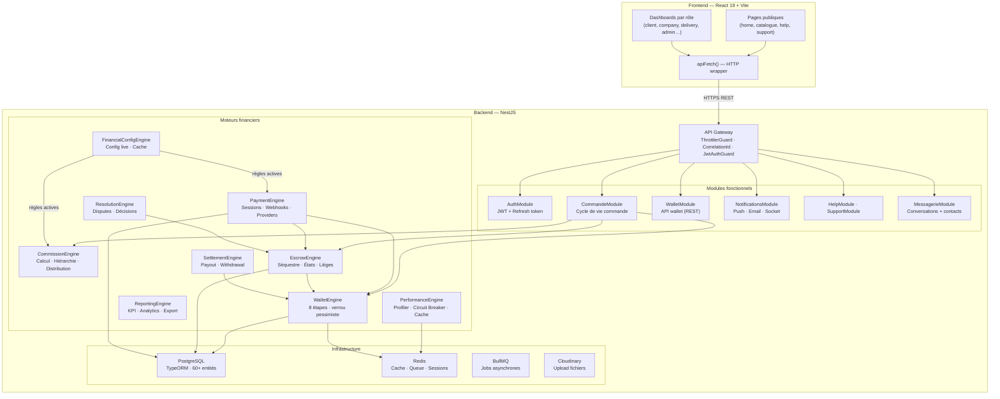
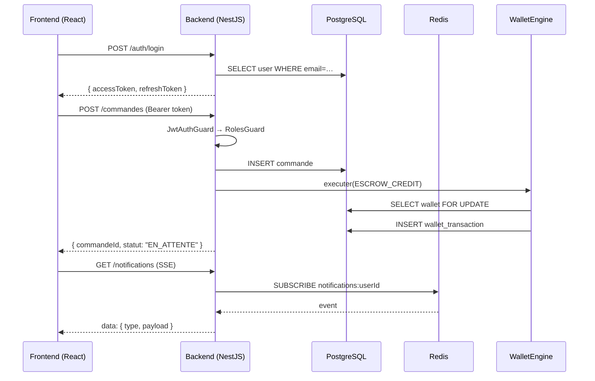
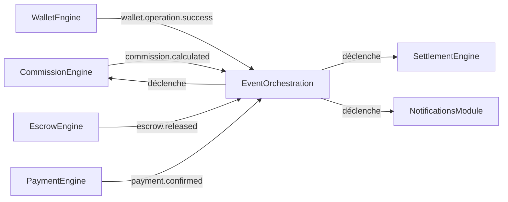

# Architecture Globale — Shopi

## Vue d'ensemble

Shopi est une plateforme e-commerce **multi-acteurs** organisée autour d'un backend NestJS avec des moteurs financiers encapsulés (escrow, wallet, commissions) et un frontend React multi-dashboard.

---

## Diagramme de l'architecture globale



---

## Découpage modulaire

### Couche 1 — Infrastructure

| Module | Rôle |
|---|---|
| `DatabaseModule` | Connexion PostgreSQL + TypeORM + migrations |
| `RedisModule` | Connexion Redis (ioredis) avec `lazyConnect: true` |
| `BullMQ` | Queue asynchrone pour jobs (notifications, settlements…) |
| `MailModule` | Envoi email via transport configurable |
| `UploadModule` | Upload Cloudinary via `memoryStorage` |

### Couche 2 — Modules fonctionnels

| Module | Rôle |
|---|---|
| `AuthModule` | Login, register, JWT access/refresh, 2FA codes |
| `CommandeModule` | Création, validation, suivi, annulation des commandes |
| `WalletModule` | API REST pour les opérations wallet (façade) |
| `PaiementModule` | Initiation et confirmation des paiements |
| `MessagerieModule` | Conversations, messages, permissions, contacts |
| `NotificationsModule` | Push, email, socket, préférences |
| `HelpModule` | Articles, FAQ, recherche |
| `SupportModule` | Tickets, agents, escalade |
| `GeoModule` | Référentiel géographique (pays → quartier) |
| `DashboardModule` | APIs dédiées aux tableaux de bord par rôle |

### Couche 3 — Moteurs financiers

Chaque moteur suit le même pattern :
- Un **Engine** (façade = point d'entrée unique)
- Des **Services** spécialisés (validator, calculator, distributor, audit, history…)
- Un **EventBus** (événements asynchrones inter-modules)
- Des **Types** centraux (interfaces, erreurs typées)

| Moteur | Fichier principal |
|---|---|
| WalletEngine | `wallet-engine/wallet.engine.ts` |
| CommissionEngine | `commission/commission.engine.ts` |
| EscrowEngine | `escrow-engine/escrow.engine.ts` |
| PaymentEngine | `payment-engine/payment.engine.ts` |
| ResolutionEngine | `resolution-engine/resolution.engine.ts` |
| SettlementEngine | `settlement-engine/settlement.engine.ts` |
| FinancialConfigEngine | `financial-config-engine/financial-config.engine.ts` |
| ReportingEngine | `reporting-engine/reporting.engine.ts` |
| PerformanceEngine | `performance-engine/performance.engine.ts` |

---

## Ordre de démarrage des modules (app.module.ts)

```
1. ConfigModule (global)
2. ThrottlerModule (rate limiting)
3. DatabaseModule, MailModule, AuthModule…
4. WalletEngineModule, EscrowEngineModule, PaymentEngineModule…
5. RedisModule → BullModule
6. SuivisModule, MessagerieModule… (consommateurs Redis)
7. NotificationsModule
8. PerformanceModule (après RedisModule)
9. HealthModule
```

> **Règle critique** : tout module injectant `@InjectRedis()` ou `@InjectQueue()` doit être déclaré **après** `RedisModule` et `BullModule`.

---

## Interactions Frontend ↔ Backend



---

## Flux des événements

Tous les moteurs financiers émettent des événements via `EventEmitter2`.
`EventOrchestrationModule` centralise les subscribers cross-modules.



Voir [flows.md](./flows.md) pour les diagrammes de flux complets.
