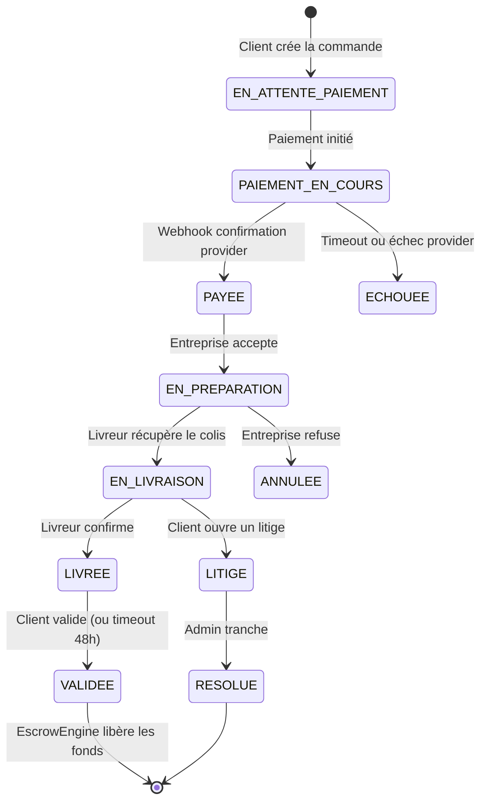
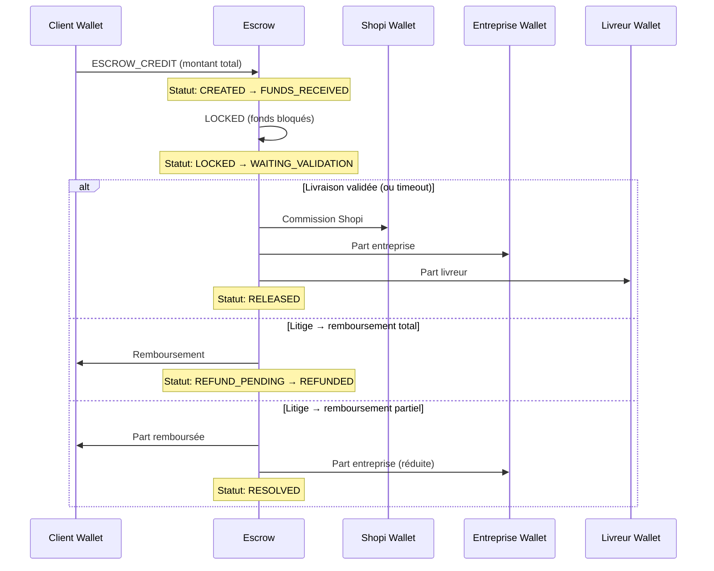
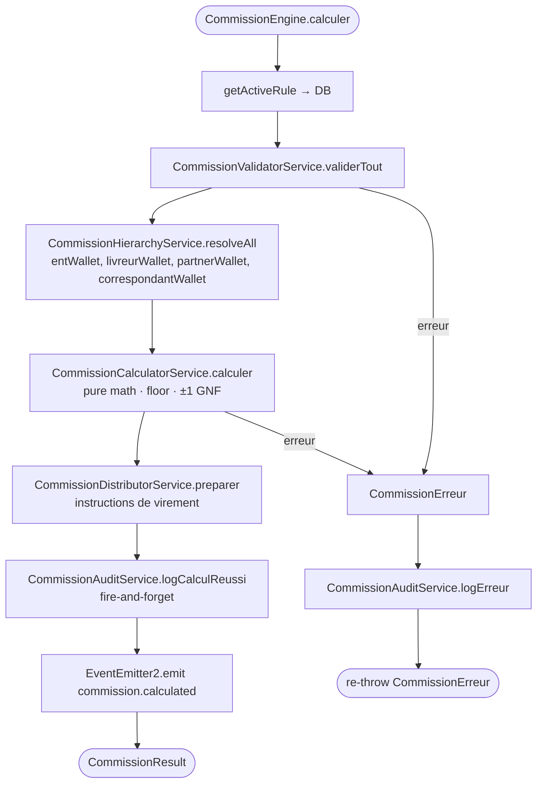
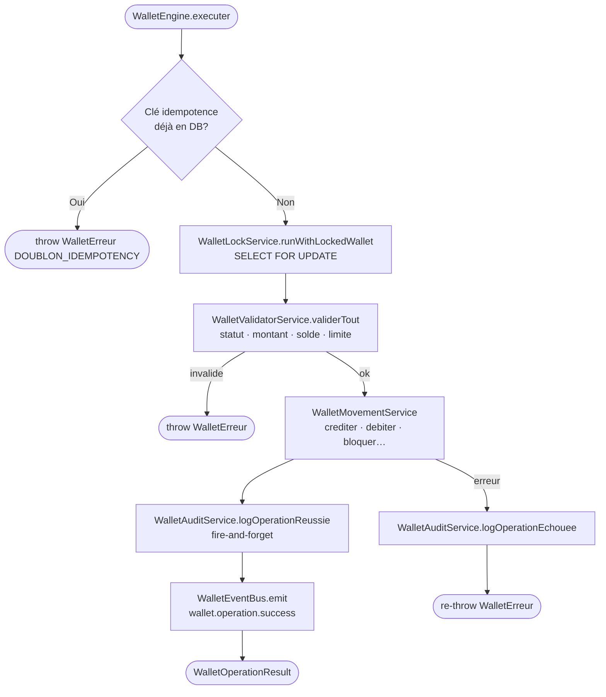
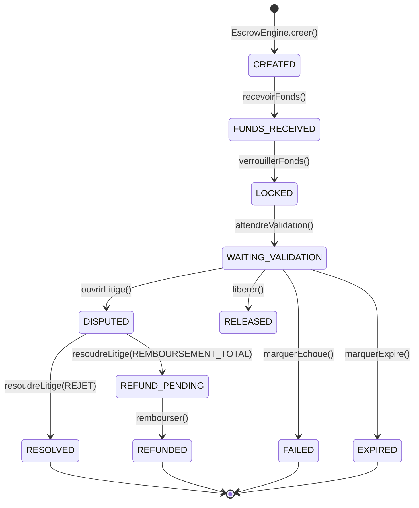
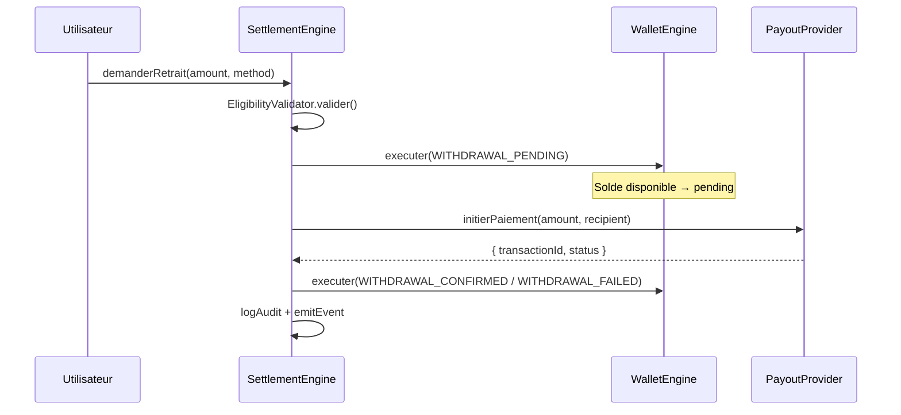
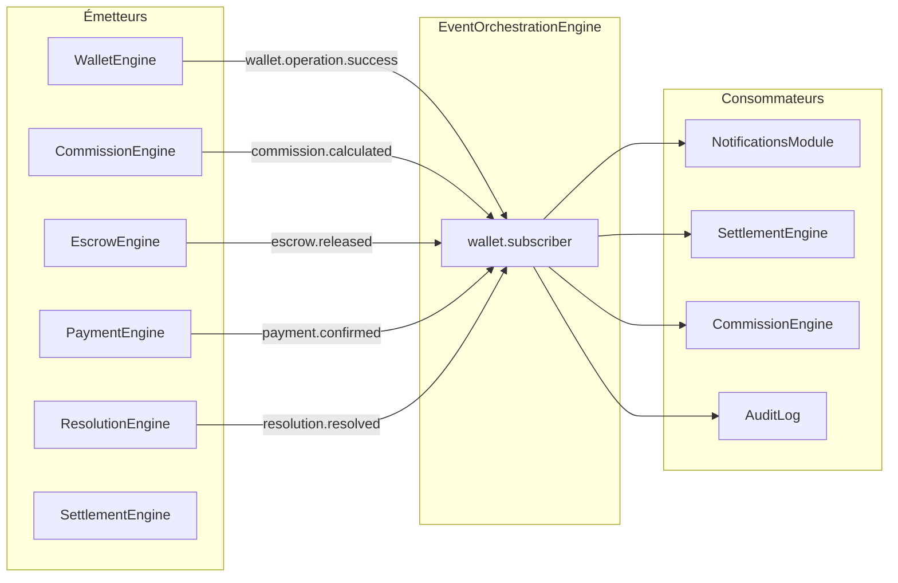

# Flux Métier et Financiers — Shopi

## Flux d'une commande complète

---

## Flux financier d'une commande

---

## Flux de calcul des commissions

---

## Flux Wallet Engine (pipeline 8 étapes)

---

## Flux Escrow — transitions d'état

---

## Flux de retrait (Settlement)

---

## Flux d'événements inter-moteurs

