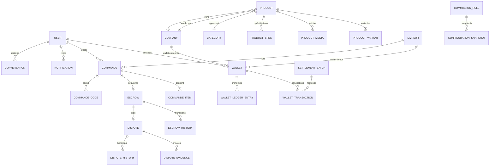

# Base de données — Documentation

**SGBD** : PostgreSQL  
**ORM** : TypeORM  
**Migrations** : `src/database/migrations/`

---

## Schéma conceptuel



---

## Groupes d'entités

### Utilisateurs et profils
| Entité | Table | Rôle |
|---|---|---|
| `User` | `user` | Compte utilisateur (tous rôles) |
| `AppearancePreference` | `appearance_preference` | Préférences UI |
| `Localisation` | `localisation` | Coordonnées GPS |

### Finance
| Entité | Table | Rôle |
|---|---|---|
| `Wallet` | `wallet` | Porte-monnaie (1 par acteur) |
| `WalletTransaction` | `wallet_transaction` | Écriture comptable |
| `WalletLedgerEntry` | `wallet_ledger_entry` | Grand livre double entrée |
| `Escrow` | `escrow` | Séquestre d'une commande |
| `EscrowHistory` | `escrow_history` | Journal de transitions |
| `Dispute` | `dispute` | Litige |
| `DisputeEvidence` | `dispute_evidence` | Preuves |
| `DisputeHistory` | `dispute_history` | Journal du litige |
| `CommissionRule` | `commission_rule` | Règles de commission actives |
| `ConfigurationSnapshot` | `configuration_snapshot` | Snapshot de config au moment du calcul |
| `SettlementBatch` | `settlement_batch` | Lot de settlements |

### Commandes
| Entité | Table | Rôle |
|---|---|---|
| `Commande` | `commande` | Commande principale |
| `CommandeItem` | `commande_item` | Ligne de commande |
| `CommandeCode` | `commande_code` | Codes de validation |

### Catalogue
| Entité | Table | Rôle |
|---|---|---|
| `Product` | `product` | Produit |
| `ProductVariant` | `product_variant` | Variante (taille, couleur…) |
| `ProductMedia` | `product_media` | Photos/vidéos |
| `ProductSpec` | `product_spec` | Spécifications techniques |
| `ProductStory` | `product_story` | Storytelling produit |
| `Category` | `category` | Catégorie |
| `SubCategory` | `sub_category` | Sous-catégorie |
| `Promotion` | `promotion` | Promotion |

### Géographie
| Entité | Rôle |
|---|---|
| `GeoPays` | Pays |
| `GeoRegion` | Région |
| `GeoPrefecture` | Préfecture |
| `GeoCommune` | Commune |
| `GeoQuartier` | Quartier |
| `GeoZone` | Zone de livraison |

### Messagerie
| Entité | Table | Rôle |
|---|---|---|
| `Conversation` | `conversation` | Fil de discussion |
| `Message` | `message` | Message |
| `MessageReadReceipt` | `message_read_receipt` | Accusé de lecture |
| `ConversationPermission` | `conversation_permission` | Permissions d'accès |

### Support & Help
| Entité | Rôle |
|---|---|
| `HelpArticle` | Article d'aide |
| `HelpCategory` | Catégorie d'aide |
| `HelpFaqItem` | Question fréquente |
| `HelpSearchQuery` | Requêtes de recherche |

### Notifications
| Entité | Rôle |
|---|---|
| `Notification` | Notification |
| `NotificationPreference` | Préférences |
| `NotificationDeliveryLog` | Log d'envoi |

---

## Index importants

```sql
-- Wallet — lookups fréquents
CREATE INDEX idx_wallet_user_id ON wallet(user_id);
CREATE INDEX idx_wallet_status ON wallet(status);

-- WalletTransaction — historique + idempotence
CREATE INDEX idx_wallet_tx_wallet_id ON wallet_transaction(wallet_id);
CREATE UNIQUE INDEX idx_wallet_tx_idempotency ON wallet_transaction(idempotency_key)
  WHERE idempotency_key IS NOT NULL;

-- Commande — filtres dashboard
CREATE INDEX idx_commande_status ON commande(status);
CREATE INDEX idx_commande_client_id ON commande(client_id);
CREATE INDEX idx_commande_livreur_id ON commande(livreur_id);
CREATE INDEX idx_commande_created_at ON commande(created_at DESC);

-- Escrow
CREATE INDEX idx_escrow_commande_id ON escrow(commande_id);
CREATE INDEX idx_escrow_status ON escrow(status);

-- Notification
CREATE INDEX idx_notification_user_id_read ON notification(user_id, is_read);
```

---

## Historique des migrations

| Migration | Timestamp | Contenu |
|---|---|---|
| `add-client-settings-fields` | 1700000000000 | Champs paramètres client |
| `add-follow-isSubscribed` | 1700000000001 | Flag abonnement |
| `paiement-system-complete` | 1721000000000 | Tables wallet, escrow, paiement complètes |
| `commission-enum-extension` | 1721000000001 | Enums types de commission |
| `wallet-engine-extension` | 1721000000002 | Colonnes balance types, ledger |
| `escrow-engine` | 1721000000003 | Table escrow + transitions |
| `payment-engine` | 1721000000004 | Sessions de paiement |
| `resolution-engine` | 1721000000005 | Disputes + evidence |
| `settlement-engine` | 1721000000006 | Settlement batches |
| `financial-config-engine` | 1721000000007 | Config financière live |
| `reporting-engine` | 1721000000008 | Tables reporting |
| `performance-indexes` | 1721100000000 | Index de performance |

---

## Règles d'intégrité

1. **Un wallet par acteur** — contrainte UNIQUE sur `(user_id, wallet_type)`
2. **Clé idempotence unique** — index unique sur `wallet_transaction.idempotency_key` (nullable)
3. **Pas de suppression** — soft delete via `deleted_at` + `@DeleteDateColumn`
4. **Montants entiers** — type `integer` (GNF), jamais `float`
5. **FK with ON DELETE RESTRICT** — pas de suppression en cascade pour les données financières
6. **Audit log immuable** — `audit_log` : INSERT uniquement, jamais UPDATE/DELETE

---

## Connexion et configuration

```typescript
// src/config/database.config.ts
{
  type: 'postgres',
  url: process.env.DATABASE_URL,
  entities: [__dirname + '/../**/*.entity{.ts,.js}'],
  migrations: [__dirname + '/../database/migrations/*{.ts,.js}'],
  synchronize: false,  // Toujours false en production
  logging: process.env.NODE_ENV === 'development',
}
```

> `synchronize: false` en production. Toujours utiliser les migrations TypeORM.
