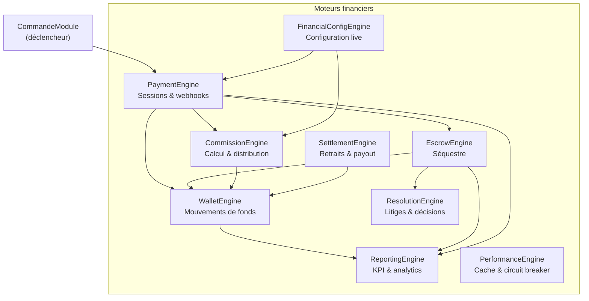

# Moteurs Financiers — Vue d'ensemble

Shopi dispose de **9 moteurs financiers** autonomes, chacun encapsulant un domaine précis.

---

## Cartographie des moteurs



---

## Index des moteurs

| Moteur | Doc | Rôle résumé |
|---|---|---|
| WalletEngine | [wallet-engine.md](./wallet-engine.md) | Point d'entrée unique pour tous les mouvements de fonds |
| CommissionEngine | [commission-engine.md](./commission-engine.md) | Calcule et distribue les commissions |
| EscrowEngine | [escrow-engine.md](./escrow-engine.md) | Séquestre les fonds pendant la livraison |
| PaymentEngine | [payment-engine.md](./payment-engine.md) | Gère les sessions de paiement et les webhooks providers |
| ResolutionEngine | [resolution-engine.md](./resolution-engine.md) | Instruit et résout les litiges |
| SettlementEngine | [settlement-engine.md](./settlement-engine.md) | Gère les retraits et les virements vers les providers |
| FinancialConfigEngine | [financial-config-engine.md](./financial-config-engine.md) | Configuration financière live avec cache Redis |
| ReportingEngine | [reporting-engine.md](./reporting-engine.md) | KPI, analytics, exports, alertes |
| PerformanceEngine | [performance-engine.md](./performance-engine.md) | Cache, circuit breaker, profiler |

---

## Pattern commun à tous les moteurs

```
module/
├── [module].engine.ts          ← Façade (point d'entrée unique)
├── [module].engine.spec.ts     ← Tests unitaires du moteur
├── [module].module.ts          ← NestJS Module (imports, exports)
├── services/
│   ├── [module]-validator.service.ts     ← Validation préconditions
│   ├── [module]-calculator.service.ts    ← Logique métier pure
│   ├── [module]-audit.service.ts         ← Traçabilité (fire-and-forget)
│   └── [module]-history.service.ts       ← Lecture historique
├── events/
│   ├── [module]-event-bus.service.ts     ← Émission d'événements
│   └── [module].events.ts                ← Définition des événements
└── types/
    └── [module].types.ts                  ← Interfaces + erreurs typées
```

### Principes invariants

1. **Façade unique** — l'engine est le seul point d'entrée public
2. **Erreurs typées** — chaque moteur a son propre `XxxErreur` avec `XxxErreurType`
3. **Audit fire-and-forget** — `logX()` n'est jamais `await`-é dans le chemin critique
4. **Événements asynchrones** — `EventEmitter2.emit()` après l'opération, jamais avant
5. **Pas de dépendance circulaire** — les moteurs s'appellent dans une direction unique

### Sens des dépendances

```
PaymentEngine → EscrowEngine → WalletEngine
ResolutionEngine → EscrowEngine
SettlementEngine → WalletEngine
CommissionEngine → WalletEngine (via distributor)
FinancialConfigEngine ← CommissionEngine (lit la config)
```
