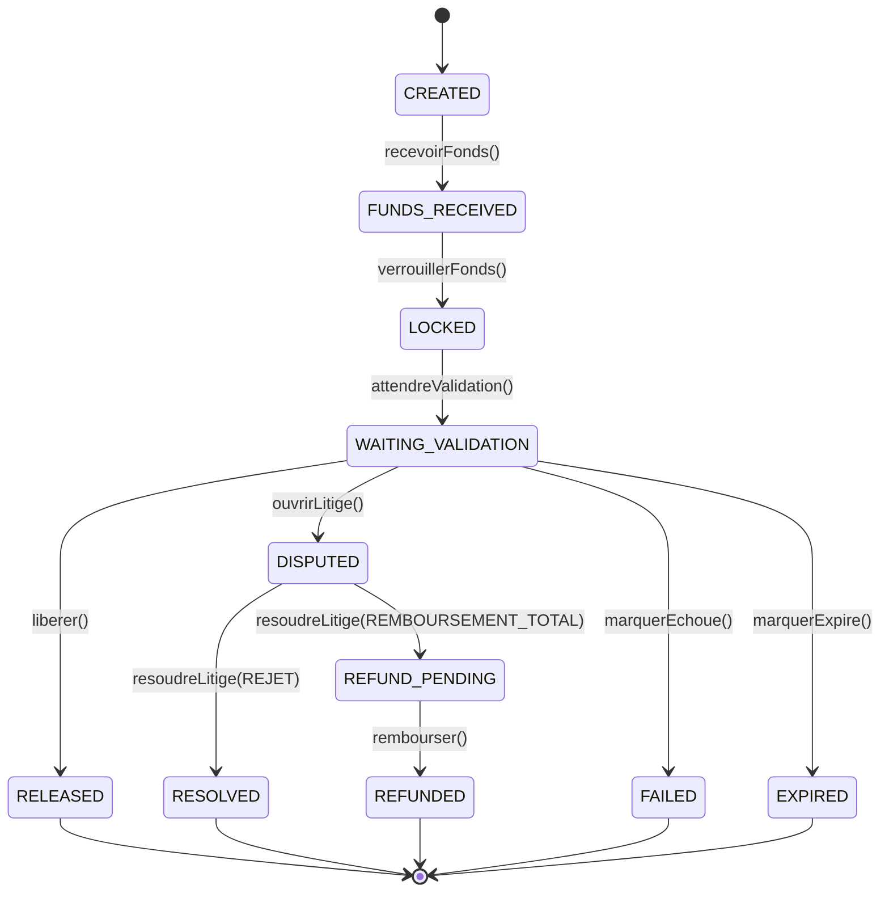

# EscrowEngine

**Fichier** : `src/modules/escrow-engine/escrow.engine.ts`  
**Module** : `EscrowEngineModule`

---

## Responsabilités

L'EscrowEngine gère le **séquestre** des fonds pendant toute la durée d'une commande.

- Séquestrer les fonds du client au moment du paiement
- Maintenir la machine à états de l'escrow (10 états)
- Libérer les fonds vers les acteurs après validation
- Rembourser le client en cas de litige ou d'annulation
- Gérer l'ouverture et la résolution des litiges

---

## Machine à états

---

## API publique de l'EscrowEngine

| Méthode | Description |
|---|---|
| `creer(ctx)` | Crée un escrow (état CREATED) |
| `recevoirFonds(ctx)` | Enregistre la réception des fonds (FUNDS_RECEIVED) |
| `verrouillerFonds(ctx)` | Bloque les fonds (LOCKED) |
| `attendreValidation(ctx)` | Passe en attente de validation client (WAITING_VALIDATION) |
| `liberer(ctx)` | Libère les fonds vers entreprise + livreur + Shopi (RELEASED) |
| `rembourser(ctx)` | Rembourse le client (REFUNDED) |
| `ouvrirLitige(ctx)` | Ouvre un litige (DISPUTED) |
| `resoudreLitige(ctx)` | Clôt le litige (RESOLVED ou REFUND_PENDING) |
| `marquerEchoue(ctx)` | Marque l'escrow comme échoué |
| `marquerExpire(ctx)` | Marque l'escrow comme expiré (timeout) |
| `getHistorique(filter)` | Historique paginé des escrows |

---

## Délégations

| Opération | Délégué |
|---|---|
| Tout mouvement de fonds | `WalletEngine` |
| Création / transitions d'état | `EscrowManagerService` |
| Libération vers acteurs | `EscrowReleaseService` |
| Remboursement client | `EscrowRefundService` |
| Historique d'un escrow | `EscrowHistoryService` |
| Validation des transitions | `EscrowValidatorService` |
| Audit (fire-and-forget) | `EscrowAuditService` |
| Événements | `EscrowEventBus` |

---

## Erreurs (`EscrowErreurType`)

| Code | Cause |
|---|---|
| `ESCROW_INTROUVABLE` | escrowId inconnu |
| `TRANSITION_INVALIDE` | état actuel incompatible avec l'opération |
| `MONTANT_INVALIDE` | montant ≤ 0 |
| `WALLET_INTROUVABLE` | wallet d'un acteur absent |
| `LITIGE_DEJA_OUVERT` | litige déjà en cours |
| `LITIGE_INTROUVABLE` | aucun litige ouvert |
| `ERREUR_INTERNE` | erreur système |

---

## Événements émis

| Événement | État source → cible |
|---|---|
| `escrow.created` | → CREATED |
| `escrow.funds_received` | → FUNDS_RECEIVED |
| `escrow.locked` | → LOCKED |
| `escrow.waiting_validation` | → WAITING_VALIDATION |
| `escrow.released` | → RELEASED |
| `escrow.refunded` | → REFUNDED |
| `escrow.disputed` | → DISPUTED |
| `escrow.resolved` | → RESOLVED |
| `escrow.failed` | → FAILED |
| `escrow.expired` | → EXPIRED |

---

## Entités DB associées

| Entité | Table | Rôle |
|---|---|---|
| `Escrow` | `escrow` | Enregistrement principal avec statut |
| `EscrowHistory` | `escrow_history` | Journal de chaque transition |
| `Dispute` | `dispute` | Litige rattaché à l'escrow |
| `DisputeHistory` | `dispute_history` | Journal du litige |
| `DisputeEvidence` | `dispute_evidence` | Preuves soumises |
