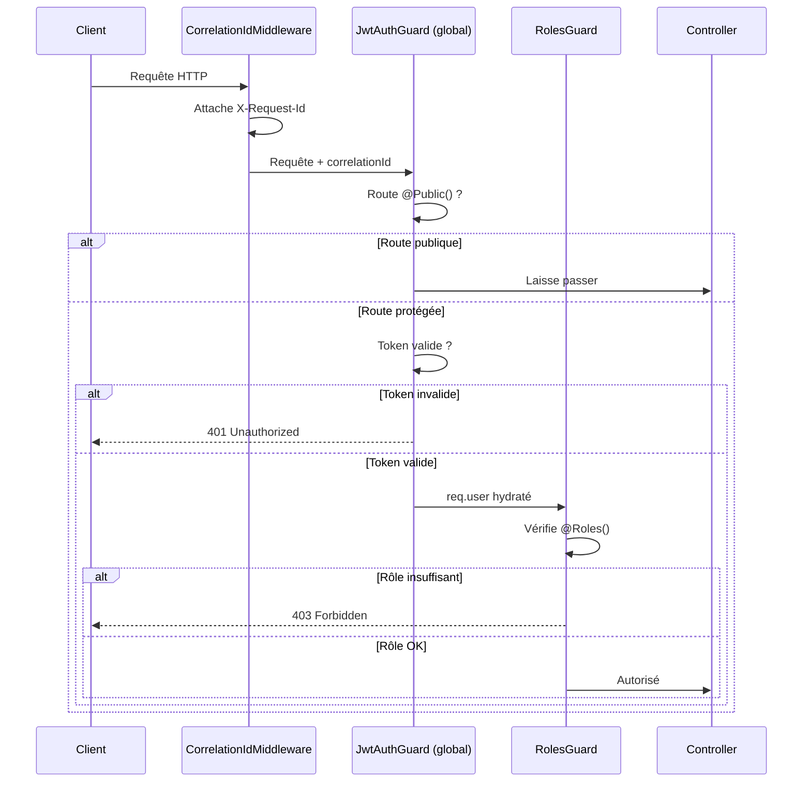

# Module `common` — Infrastructure transversale

> **Rôle** : Fournir les briques fondamentales partagées par **tous** les modules de Shopi.  
> Aucun module métier ne devrait réimplémenter ce que `common` expose.

---

## Pourquoi ce module existe

`common` évite la duplication du code d'infrastructure critique. Sans lui, chaque module
définirait son propre guard JWT, son propre identifiant de rôle, sa propre exception 404.
Ces divergences entraîneraient des comportements incohérents (un module bloquerait là où
un autre laisserait passer) et rendraient la maintenance périlleuse.

---

## Organisation interne

```
src/common/
├── decorators/
│   ├── public.decorator.ts        — @Public() : marque une route comme accessible sans JWT
│   └── roles.decorator.ts         — @Roles() : restreint l'accès · @CurrentUser() : injecte le user
├── enums/
│   └── user-role.enum.ts          — Les 7 rôles du système (source de vérité)
├── exceptions/
│   ├── help-center.exceptions.ts  — 9 exceptions métier du Centre d'aide
│   └── support.exceptions.ts      — 12 exceptions métier du Support client
├── guards/
│   ├── auth.guard.ts              — JwtAuthGuard : protège les routes (laisse passer @Public())
│   ├── optional-jwt.guard.ts      — OptionalJwtAuthGuard : tente le JWT sans bloquer si absent
│   └── roles.guard.ts             — RolesGuard : vérifie le rôle de l'utilisateur connecté
├── health/
│   ├── health.controller.ts       — GET /health → {status, timestamp, environment, version}
│   └── health.module.ts           — Module NestJS du health check
└── middleware/
    └── correlation-id.middleware.ts — Attache un X-Request-Id unique à chaque requête
```

---

## Composants en détail

### Décorateurs

#### `@Public()`
Bypass le `JwtAuthGuard` pour une route ou un contrôleur entier.  
Toute route **non** décorée avec `@Public()` requiert un token JWT valide.

```typescript
@Get('catalogue')
@Public()                    // Accessible sans connexion
findAll() { ... }

@Get('commandes')            // JWT obligatoire (comportement par défaut)
findMyOrders() { ... }
```

#### `@Roles(...roles)`
Restreint l'accès aux utilisateurs possédant le rôle requis.  
**Doit être utilisé APRÈS `JwtAuthGuard`** (qui peuple `req.user`).

```typescript
@UseGuards(JwtAuthGuard, RolesGuard)
@Roles(UserRole.SUPER_ADMIN)
@Delete('users/:id')
deleteUser() { ... }
```

#### `@CurrentUser()`
Injecte l'utilisateur connecté depuis `req.user` (peuplé par `JwtStrategy`).

```typescript
@Get('me')
getProfile(@CurrentUser() user: User) {
  return user;
}
```

---

### Enum `UserRole`

Les 7 rôles du système, dans l'ordre hiérarchique :

| Valeur | Rôle | Accès |
|---|---|---|
| `super_admin` | Administrateur global | Tout |
| `admin` | Administrateur | Modération, rapports |
| `company` | Entreprise / Vendeur | Catalogue, commandes, livreurs |
| `delivery` | Livreur | Commandes à livrer |
| `partner` | Partenaire | Intégrations |
| `correspondent` | Correspondant | Dépôts, colis |
| `client` | Client | Achats, wallet |

> **⚠️ Impact critique** : Toute modification de `UserRole` affecte la table `user` en base de données,
> toutes les routes protégées par `@Roles()`, et tous les guards. Une migration est requise.

---

### Guards

#### `JwtAuthGuard`
Guard global (appliqué dans `AppModule` via `APP_GUARD`). Vérifie le token JWT sur chaque requête.  
Deux exceptions : route marquée `@Public()`, ou token absent sur une route `OptionalJwtAuthGuard`.

**Flux de décision :**
```
Requête entrante
  → Route @Public() ? → OUI → Laisse passer (return true)
  → Token JWT présent et valide ? → NON → 401 Unauthorized
  → OUI → req.user hydraté → Laisse passer
```

#### `OptionalJwtAuthGuard`
Pour les routes publiques qui bénéficient d'un contexte utilisateur si disponible.  
Exemple : page produit publique qui affiche "Ajouter aux favoris" si connecté.

```
Token présent et valide → req.user hydraté
Token absent/invalide  → req.user = undefined (JAMAIS d'erreur)
```

#### `RolesGuard`
Utilisé en complément de `JwtAuthGuard`. Lit les métadonnées `@Roles()` et vérifie que
`req.user.role` figure dans la liste des rôles autorisés.

---

### Health check

**Endpoint** : `GET /health` (public, sans JWT)

**Réponse** :
```json
{
  "status": "ok",
  "timestamp": "2026-07-18T12:00:00.000Z",
  "environment": "production",
  "version": "v1.4.2"
}
```

**Utilisé par** : Render (health probe), UptimeRobot, load balancers.  
**Sécurité** : Aucune information sensible (pas de config DB, pas de stack trace).

---

### Middleware `CorrelationIdMiddleware`

Attache un identifiant unique (`UUID v4`) à chaque requête HTTP.

- **Entrée** : Lit `X-Request-Id` si présent (API gateway, Postman).
- **Sortie** : Renvoie `X-Request-Id` dans la réponse.
- **Accès** : `req['correlationId']` dans les services.

**Pourquoi** : Sans correlation ID, il est impossible de relier les logs d'une même
requête entre plusieurs instances ou microservices. Ce middleware est le socle de
toute l'observabilité (Sentry, Logtail, OpenTelemetry).

---

### Exceptions métier

Les exceptions métier sont regroupées par domaine dans `common/exceptions/`.

**Pattern** : Chaque exception étend `HttpException` avec :
- Un `message` humain en français
- Un `errorCode` stable en SCREAMING_SNAKE_CASE (pour l'i18n future)

```typescript
// Côté service
throw new TicketNotFoundException(ticketId);

// Ce que reçoit le client
// HTTP 404 : { "message": "Ticket introuvable ...", "errorCode": "TICKET_NOT_FOUND" }
```

**Fichiers disponibles** :

| Fichier | Exceptions | Domaine |
|---|---|---|
| `help-center.exceptions.ts` | 9 | Articles, catégories, FAQ, recherche, feedback |
| `support.exceptions.ts` | 12 | Tickets, messages, pièces jointes, SLA, CSAT |

---

## Dépendances

### Ce module dépend de :
- `@nestjs/common` — `HttpException`, `HttpStatus`, `Injectable`, guards, decorators
- `@nestjs/core` — `Reflector` (lecture des métadonnées)
- `@nestjs/passport` — `AuthGuard` (base des guards JWT)
- `rxjs` — `Observable` (gestion du cas async dans `OptionalJwtAuthGuard`)
- `crypto` (Node.js built-in) — `randomUUID()` dans le middleware

### Les modules suivants dépendent de `common` :
**Tous les modules** — les guards, décorateurs et exceptions sont utilisés dans l'ensemble du projet.

Dépendances directes documentées :
- **Auth** : importe `JwtAuthGuard` (déclaré global dans `AppModule`)
- **Tous les controllers** : utilisent `@Public()`, `@Roles()`, `@CurrentUser()`
- **Help** : importe `help-center.exceptions.ts`
- **Support** : importe `support.exceptions.ts`
- **AppModule** : enregistre `CorrelationIdMiddleware` et `HealthModule`

---

## Flux de sécurité global



---

## Règles de modification

| Fichier | Risque si modifié | Précaution |
|---|---|---|
| `user-role.enum.ts` | **CRITIQUE** — casse DB + toutes les routes | Migration requise + vérifier tous les `@Roles()` |
| `auth.guard.ts` (JwtAuthGuard) | **CRITIQUE** — change l'auth globale | Tester toutes les routes publiques et protégées |
| `roles.guard.ts` | **ÉLEVÉ** — change le contrôle d'accès | Vérifier les tests RBAC |
| `public.decorator.ts` | **ÉLEVÉ** — change le bypass JWT | Vérifier `IS_PUBLIC_KEY` cohérent avec `JwtAuthGuard` |
| `health.controller.ts` | **FAIBLE** — endpoint sans impact métier | Ne pas exposer d'infos sensibles |
| `correlation-id.middleware.ts` | **FAIBLE** — observabilité seulement | Ne pas retirer, socle du tracing |

---

## ⚠️ Incohérences détectées (Phase 12 — Vérification)

### Duplication des guards

Il existe **deux implémentations parallèles** de `JwtAuthGuard` et `RolesGuard` :

| Fichier | Utilisé par | Supporte @Public() | handleRequest override |
|---|---|---|---|
| `common/guards/auth.guard.ts` | 40+ controllers | ✅ Oui | ❌ Non |
| `auth/guards/guards.ts` | email.controller.ts uniquement | ❌ Non | ✅ Oui |

**Impact** : `email.controller.ts` utilise un guard qui ignore `@Public()`.
Si une route email est marquée `@Public()`, elle sera quand même bloquée par ce guard.

**Recommandation** : Migrer `email.controller.ts` vers `common/guards/auth.guard.ts`
et supprimer la duplication dans `auth/guards/guards.ts`.

---

## Points d'extension

1. **Ajouter un rôle** : Modifier `UserRole`, écrire une migration, vérifier toutes les routes `@Roles()`.
2. **Ajouter un check au health endpoint** : Injecter `DataSource` + `ioRedis` dans `HealthController`, retourner `503` si KO.
3. **Ajouter une exception** : Créer un fichier dans `exceptions/` nommé `<module>.exceptions.ts`.
4. **Internationaliser les messages** : Les `errorCode` sont déjà en place — brancher un service i18n qui mappe les codes.

---

*Auteur : Shopi03 · Dernière mise à jour : 2026-07-18*
